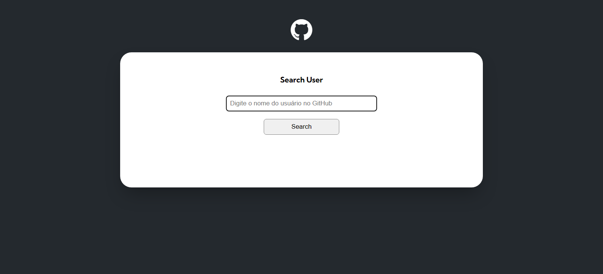

# Search for GitHub user profile

This page displays some information about GitHub users being searched. The goal of this project was to improve the concept of fetch requests when consuming APIs

Some of the information requested from the GitHub API includes:
- User name
- Bio
- Repositories
- Recent events 

## Page View
  
 
 -  Link to open: <a href="" target="_blank">click-here</a>

 ## What I unlocked
 In this project, I had the opportunity to improve my skills with module import and export, use only the necessary data from the API and validate it, utilize string interpolation, and create objects. The organization of folders and files was also one of the key areas of improvement that this project brought me.

 ## Build 
  - HTML5
  - CSS
  - Flexbox
  - JavaScript